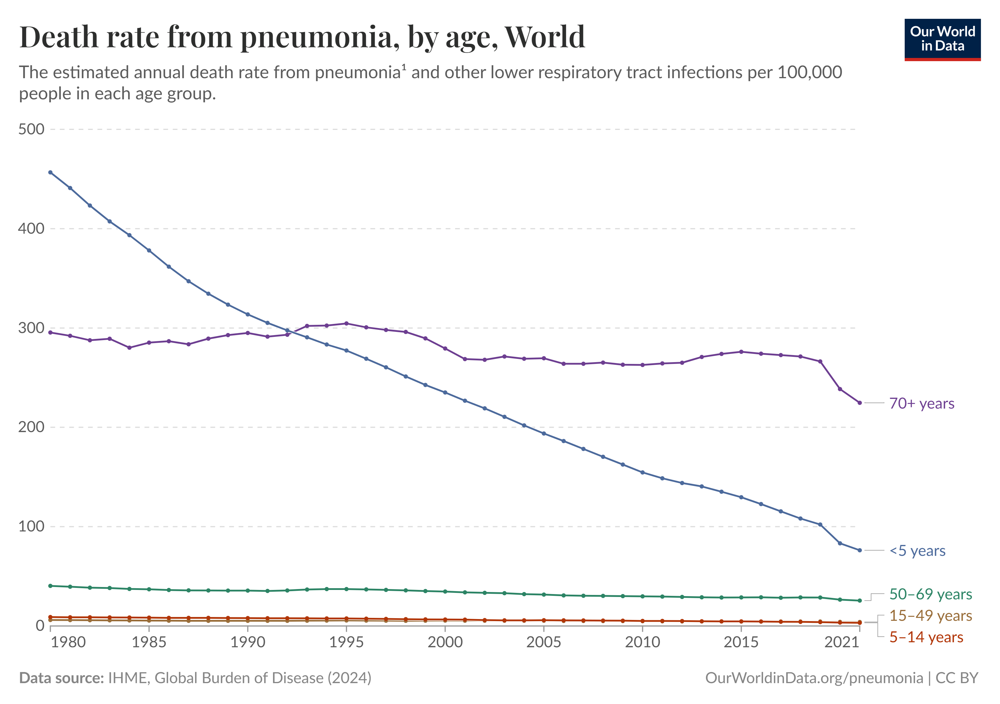
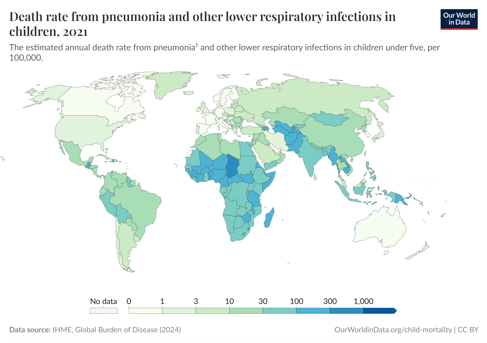
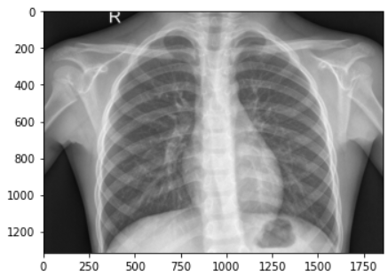
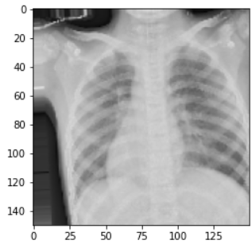
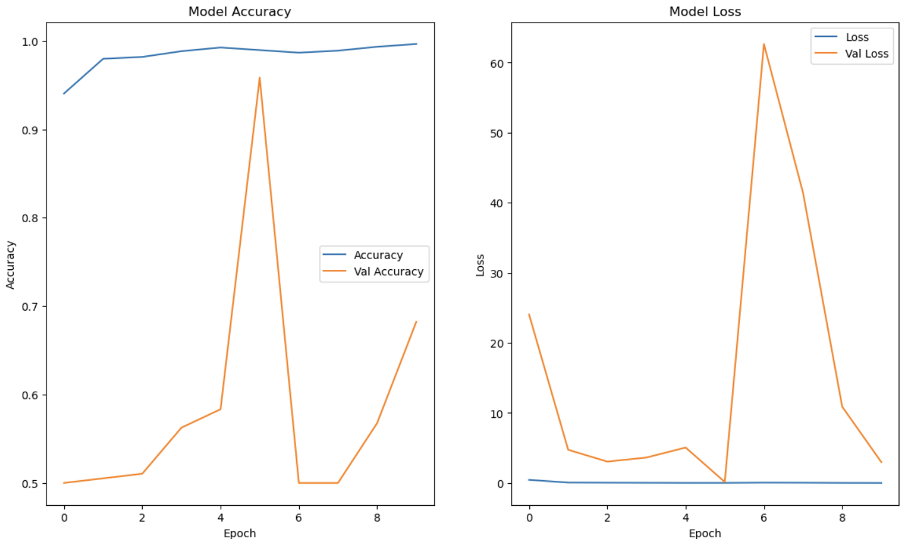
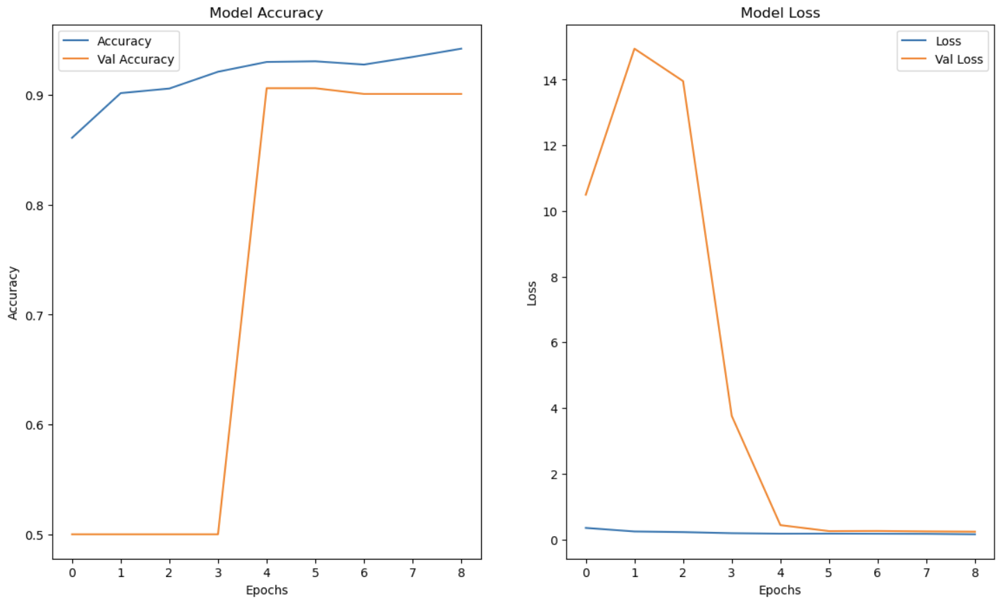
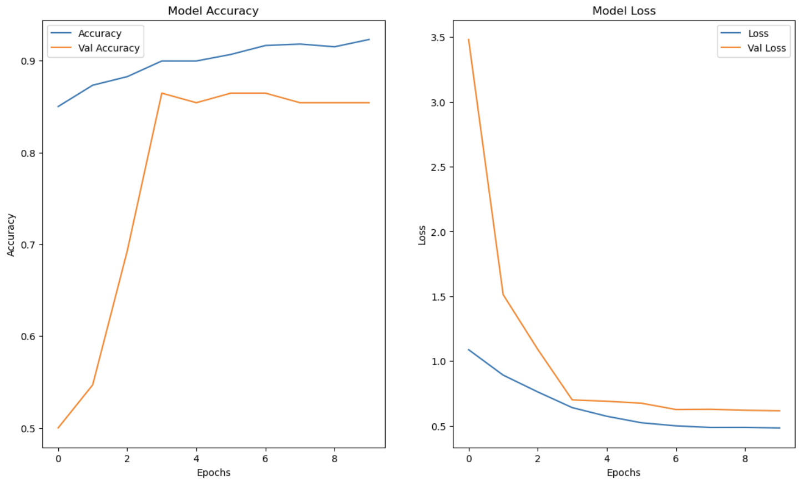
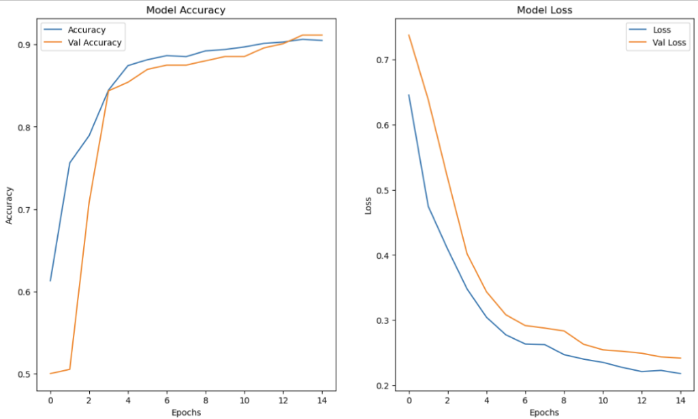

<!-- PROJECT SHIELDS -->

[![Contributors][contributors-shield]][contributors-url]
[![Activity][activity-shield]][activity-url]
<!-- [![Stargazers][stars-shield]][stars-url] -->
Eddie 
 

<!-- TABLE OF CONTENTS -->

  
Table of Contents

  <ol>
    <li>
      <a href="#business-problem">Business Problem</a>
    </li>
    <li><a href="#data">Data</a></li>
    <li><a href="#results">Results</a></li>
    <li><a href="#conclusions">Conclusions</a></li>
    <li><a href="#next-steps">Next Steps</a></li>
  </ol>

<!-- Business Proposal -->
## Business Problem

<h3 align="center">Pneumonia Detection from X-Ray Images</h3>

This project aims to train a model to be able to accurately detect pneumonia from grayscale xray images. Pneumonia is still a large issue as there is still an average of 225 deaths in eldery people and 77 deaths in young children per 100,000 people.

This graph shows that the mortality rate of children is high predominately in third world countries.

We want to focus on having a high recall score since we believe falsely diagnosing someone as normal when they have pneumonia is far worse than diagnosing someone as having pneumonia when they are normal.

Since there was a large class imbalance (4273 Pneumonia xrays vs 1583 Normal xrays), there were some steps that were taken in order to improve the learning of the network. The main step was to introduce data augmentation, which slightly altered random images each epoch so the network was essentially training on new data. An example of what the alteration might have looked like is shown below.
### Original
 

### Augment

## Data
The data comes from Kaggle and is made up of X-Ray images that belong to two classes: Pneumonia and Normal. 
* [Kaggle](https://www.kaggle.com/datasets/paultimothymooney/chest-xray-pneumonia) 

## Results

### First custom neural network performed very poorly at generalizing. It clearly was overfit on the training data

### Second custom neural network aimed to reduce the overfitting by introducing data augmentation and learning rate adjustments. While the validation accuracy improved substantially, it was still overfitting.

### Third custom neural network augmented the data even more aggressively and added some regularization through Dropout layers and kernel regularizers. This actually ended up performing even worse than the second mmodel, hurting both the training accuracy and the validation accuracy.

### This neural network used VGG16 which is a pretrained CNN with tuned weights. The dense layers had to be removed and added manually as to adapt it to this use case. The model performed quite well with the train accuracy and validation accuracy being very inline with one another. This meant that the overfitting was no longer a problem.

## Conclusions
* **The model that implemented VGG16 was the best performing one** VGG16 ended up with the least amount of overfitting and generally high accuracy. It also had a high recall score which is what we are aiming for.

## Next Steps
Further steps
* Implement Grad-CAM to improve visualization

<!-- https://home.aveek.io/GitHub-Profile-Badges/ -->

<!-- LINKS & IMAGES -->
[contributors-shield]: https://img.shields.io/github/contributors/Zxhjlk/Phase3Project.svg?style=for-the-badge
[contributors-url]: https://github.com/Zxhjlk/Phase3Project/graphs/contributors
[activity-shield]: https://img.shields.io/github/last-commit/Zxhjlk/Phase3Project?style=for-the-badge
[activity-url]: https://github.com/Zxhjlk/Phase3Project/activity

[Solidity]: https://img.shields.io/badge/Solidity-363636.svg?style=for-the-badge&logo=Solidity&logoColor=white
[Solidity-url]: https://soliditylang.org/

[Pytorch]: https://img.shields.io/badge/PyTorch-EE4C2C.svg?style=for-the-badge&logo=PyTorch&logoColor=white
[Pytorch-url]: https://pytorch.org/

[React]: https://img.shields.io/badge/React-61DAFB.svg?style=for-the-badge&logo=React&logoColor=black
[React-url]: https://react.dev/

[FastAPI]: https://img.shields.io/badge/FastAPI-009688.svg?style=for-the-badge&logo=FastAPI&logoColor=white
[Fast-url]: https://fastapi.tiangolo.com/